```{r, echo=FALSE}
source("credentials.R")
```

## Agenda

* Introduction to R

* Mortality Overview

* Mortality Models
    * Classical
    * Stochastic
    
* Workshop: Stochastic Mortality Models in R
    * Models Fitting
    * Mortality Projection - Forecasting
    * Portfolio Analysis of BEL and SCR

* Case Studies


## What is R?

<div align="center"><iframe width="560" height="315" src="http://www.youtube.com/embed/TR2bHSJ_eck" frameborder="0" allowfullscreen></iframe></div>

## R Highlights 

* <b>Free, open source, community</b> based statistical software and programming language
* Main usage: Statistical and numerical computing, Data Analysis, Data Visualisation
* Under GNU GPL (General Public License) allowing commercial usage
* Power of R in its <b>packages</b>

<b>“Everything that exists [in R] is an object. Everything that happens [in R] is a function call.”</b> - John Chambers

## RStudio {.smaller}

<b>Most popular Environment to run R</b>

<div align="center">

<p>
http://www.rstudio.com/products/rstudio/
<p>
Free & Open-Source Integrated Development Environment (IDE) for R
<p></div>
<b>Features:</b>

  1. Built-in R console
  2. R, LaTeX, HTML, C++ syntax highlighting, R code completion
  3. Easy management of multiple projects
  4. Integrated R documentation
  5. Interactive debugger
  6. Package development tools
  

Note: R must be installed first!

## Playing with R {.build}

Type in the interactive console:
```{r, eval=FALSE}
3 + 3
```
```{r, echo=F}
3 + 3
```

```{r, eval=FALSE}
getwd()
```

```{r, echo=FALSE}
getwd()
```

```{r, eval=FALSE}
1:10
```

```{r, echo=FALSE}
1:10
```

## Playing with R {.build}

Type in the interactive console:

```{r, eval=FALSE}
x <- 1:10 # "name <- value returns the value invisibly"
```
```{r, eval=FALSE}
x
```

```{r, echo=FALSE}
x <- 1:10 # "name <- value returns the value invisibly"
x
```

```{r, eval=FALSE}
(x <- 1:10) # creates x and prints it
```

```{r, echo=FALSE}
(x <- 1:10)
```

## Operations in R

<div align="center">
`x + y` addition

`x - y` substraction

`x * y` multiplication

`x / y` division

`x ^ y` exponention

`x %% y` devision remainder

`x %/% y` integer division
</div>

<p>
numeric vector `operator` numeric vector --> numeric vector

## Vectors {.build}

```{r}
(x <- 11:20) # exemplary vector
x[1] # first
x[length(x)] # last element using length function
x[c(1, length(x), 1)] # first, last and first again
```

## Vectors {.build}

```{r}
x[1000] # no such element
x * 3 # multiplication
y <- 1:10
x * y
```

## R in Insurance

* Main focus Non-life
    - fit loss distributions and perform credibility analysis - package <b>actuar</b>
    - estimate loss reserves - package <b>ChainLadder</b>
* Financial analysis
    - packages <b>YieldCurve</b>, <b>termstrc</b>
* Life insurance
    - handle demography data - package <b>demography</b>
    - demography projections - package <b>LifeTables</b>
    - actuarial and financial mathematics - package <b>lifecontingencies</b>
    - Life models - packages <b>ilc</b>, <b>LifeMetrics</b>, <b>StMoMo</b>

## <font color="white">.</font>
<center><font size="72"><b>Mortality Overview</b></font></center>
    
## Mortality Overview {.smaller}
Basic quantities in the analysis of mortality

* Survival function

$s_{x} = Pr (X > x)$

* Probability that (x) will survive for another t

$p_{xt} = s_{x+t}/s_{x}$

* Probability that (x) will die within t years

$q_{xt} = [s_{x} - s_{x+t}]/s_{x}$
			
* Mortality intensity (hazard function or force of mortality)

$\mu_{x} = lim_{h \to 0} 1/h * q_{xh}$

Probability that (x) will die within h

## Mortality Features

<center></center>

## Mortality Features

<center>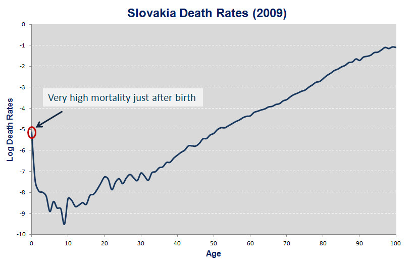</center>

## Mortality Features

<center>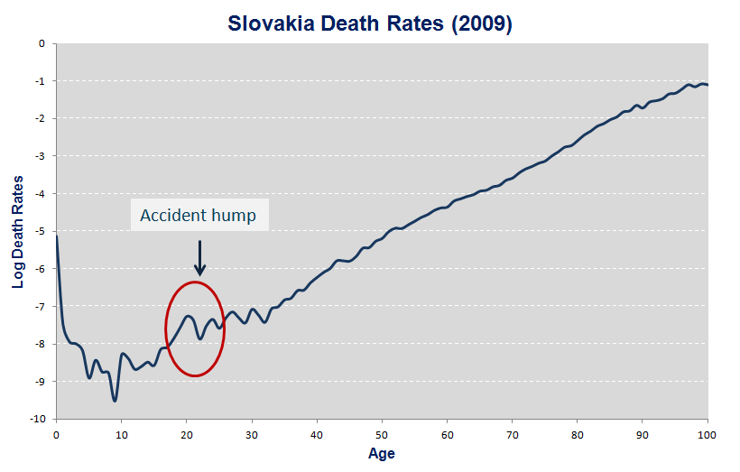</center>

## Mortality Features

<center>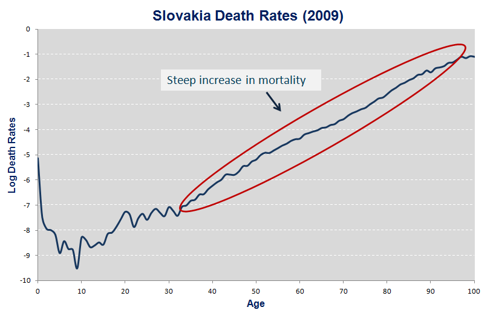</center>

## <font color="white">.</font>
<center><font size="72"><b>Mortality Models</b></font></center>

## Mortality Models

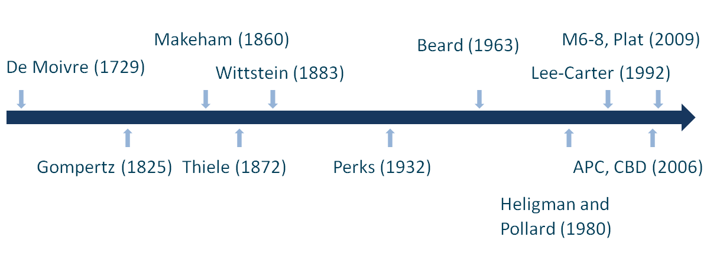

## Classic Models

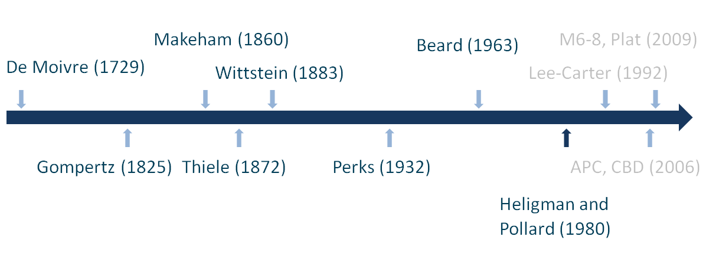

## Classic Models {.smaller}

<b>Some special parametric laws of mortality</b>

* De Moivre

$\mu_{x} = 1/ (ω – x)$ subject to $0 \leq x < ω$

* Gompertz

$\mu_{x} = Bc^{x}$ subject to $x \geq 0, B>0, c>1$

* Makeham

$\mu_{x} = A + Bc^{x}$ subject to $x \geq 0, B>0, c>1, A>=-B$

* Thiele

$\mu_{x} = B_{1}C_{1}^{-x}+B_{2}C_{2}^{[-1/2(x-k)^2]}+B_{3}C_{3}^{x}$ subject to $x\geq 0, B_{1}, B_{2}, B_{3}>0, C_{1}, C_{2}, C_{3}>1$

## Classic Models

<b>Advantages:</b>

+ Compact, small numbers of parameters
+ Highly interpretable
+ Good for comparative work

<b>Disadvantages:</b>

- Almost certainly “wrong”
- Too simplistic
- Struggle with a new source of mortality

## Stochastic Models

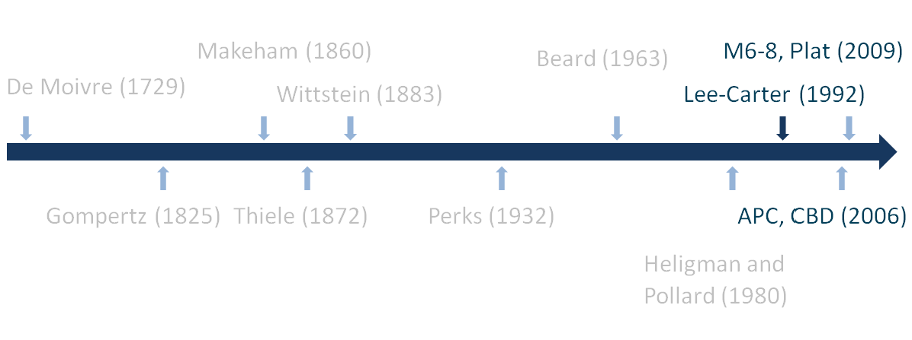

## Stochastic Models

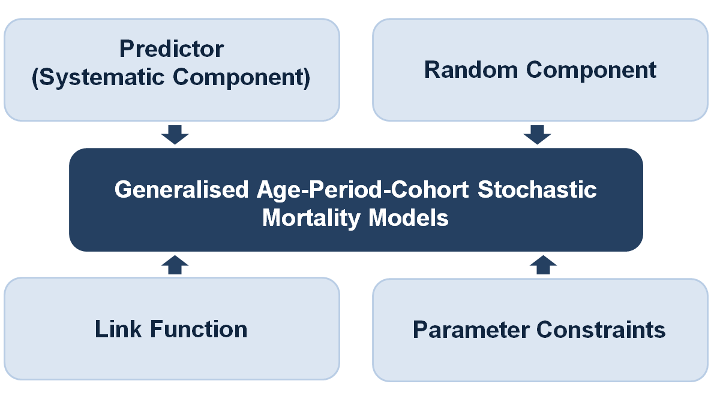

## Predictor

<center>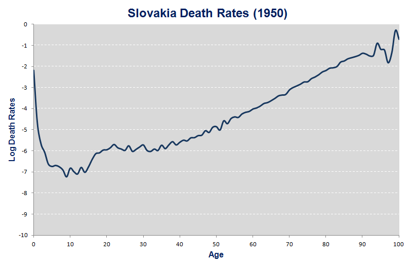</center>

## Predictor

<center></center>

## Predictor

<center>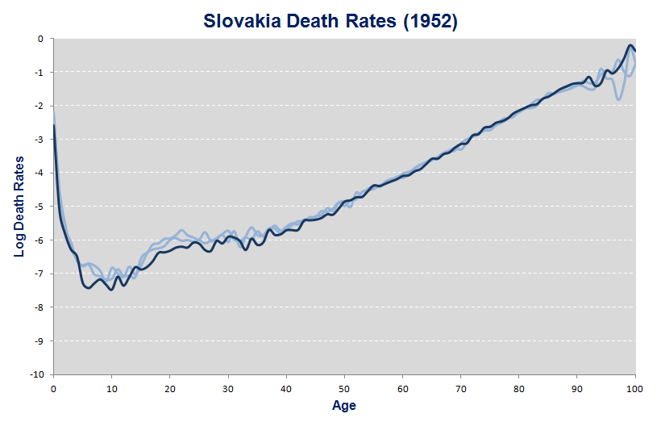</center>

## Predictor

<center>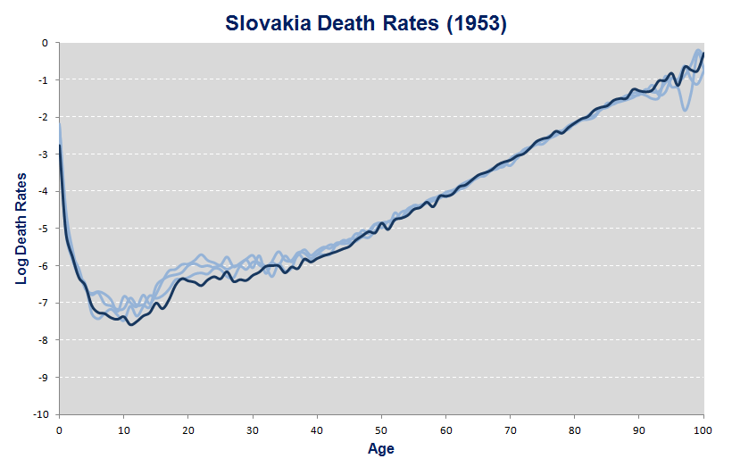</center>

## Predictor

<center>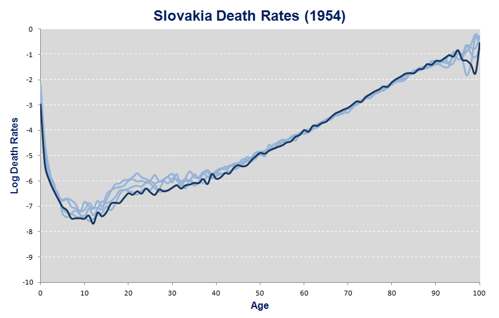</center>

## Predictor

<center></center>

## Predictor

<center>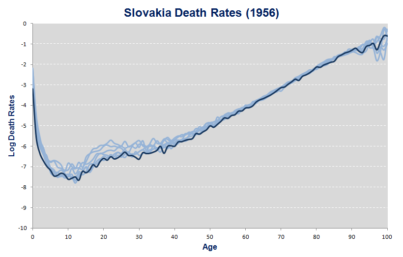</center>

## Predictor

<center>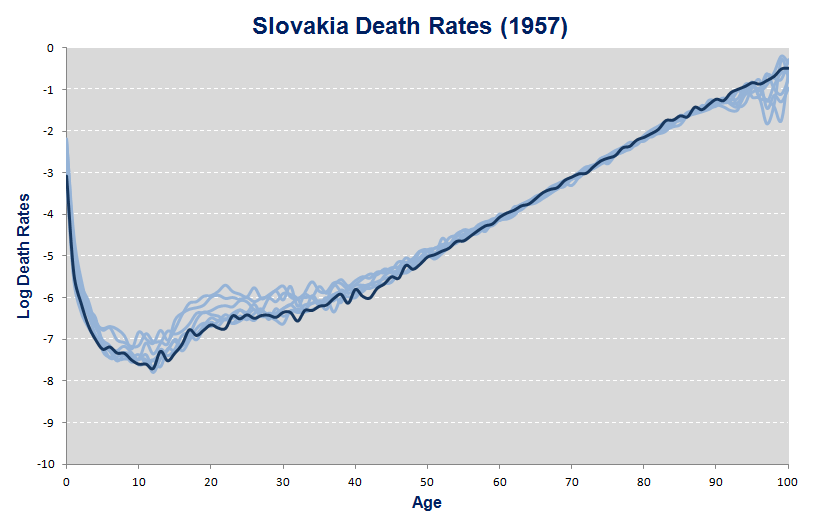</center>

## Predictor

<center>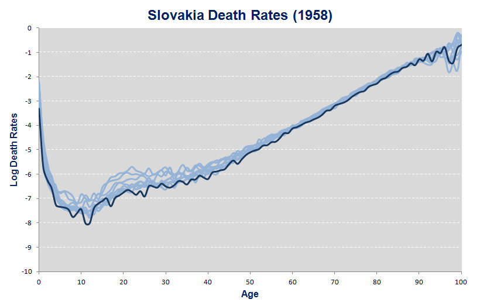</center>

## Predictor

<center>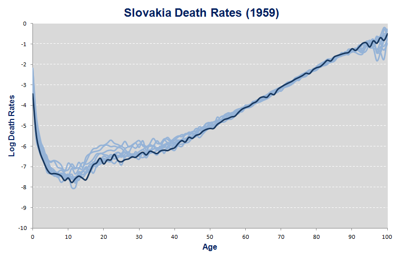</center>

## Predictor

<center></center>

## Predictor

<center>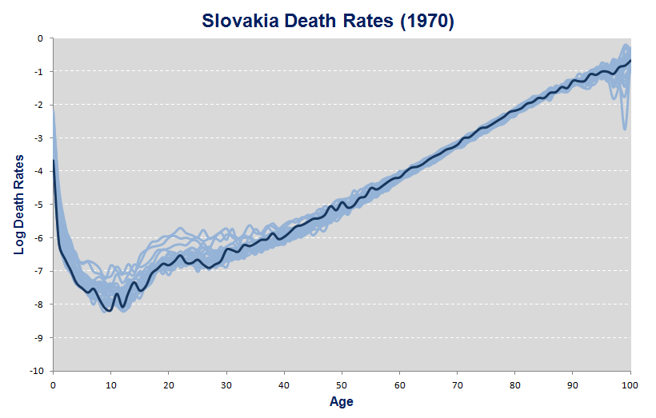</center>

## Predictor

<center>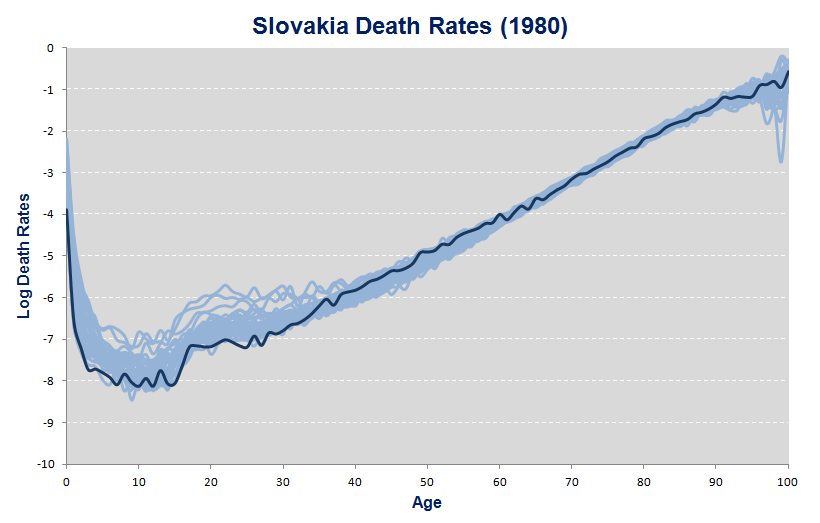</center>

## Predictor

<center>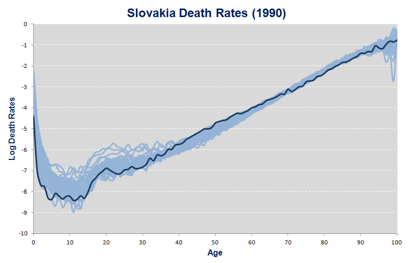</center>

## Predictor

<center>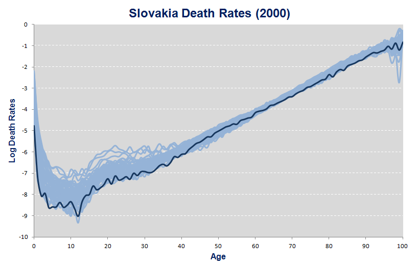</center>

## Predictor

<center>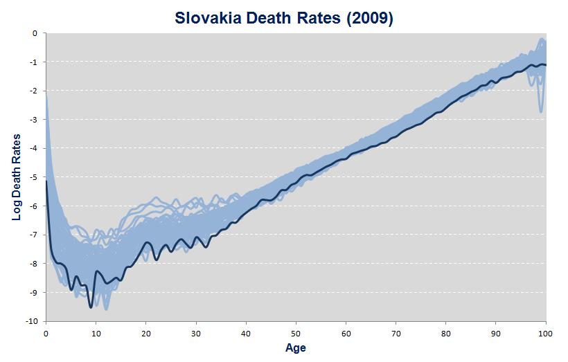</center>

## Predictor

<center></center>

$\hat{\mu}_{x}(t)$

## Predictor

<center>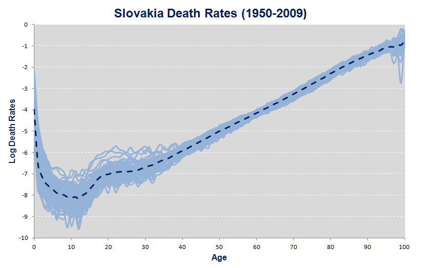</center>

$\hat{\mu}_{x}(t) = \alpha_{x}$

## Predictor

<center></center>

$\hat{\mu}_{x}(t) = \alpha_{x} + \kappa_{t}$

## Predictor

<center></center>

$\hat{\mu}_{x}(t) = \alpha_{x} + \beta_{x} \kappa_{t}$

## Predictor

<center></center>

$\hat{\mu}_{x}(t) = \alpha_{x} + \sum^{N}_{i=1} \beta^{i}_{x} \kappa^{i}_{t}$

<font size="4">$N$ - number of age-period terms</font>

## Predictor

<center></center>

$\hat{\mu}_{x}(t) = \alpha_{x} + \sum^{N}_{i=1} \beta^{i}_{x} \kappa^{i}_{t} + \gamma_{t-x}$

<font size="4">$N$ - number of age-period terms</font>

## Predictor

<center></center>

$\hat{\mu}_{x}(t) = \alpha_{x} + \sum^{N}_{i=1} \beta^{i}_{x} \kappa^{i}_{t} + \beta^{0}_{x} \gamma_{t-x}$

<font size="4">$N$ - number of age-period terms</font>

## Models Predictor {.smaller}

<b>Generalised Age-Period-Cohort Stochastic Mortality Models</b>

* Lee-Carter (LC) 
<center>$\hat{\mu_{xt}} = \alpha_{x} + \beta^{(1)}_{x} \kappa^{(1)}_{t}$</center>

* Age-Period-Cohort (APC) 
<center>$\hat{\mu_{xt}} = \alpha_{x} + \kappa^{(1)}_{t} +\gamma_{t-x}$</center>

* Cairns-Blake_Dowd (CBD) 
<center>$\hat{\mu_{xt}} = \kappa^{(1)}_{t} + (x-\bar{x})\kappa^{(2)}_{t}$</center>

* Quadratic CBD with cohort effects M6 
<center>$\hat{\mu_{xt}} = \kappa^{(1)}_{t} + (x-\bar{x})\kappa^{(2)}_{t} +\gamma_{t-x}$</center>

* Quadratic CBD with cohort effects M7 
<center>$\hat{\mu_{xt}} = \kappa^{(1)}_{t} + (x-\bar{x})\kappa^{(2)}_{t} + ((x-\bar{x})^2-\hat{\sigma^{2}_{x}}) \kappa^{3}_{t}$</center>

* Quadratic CBD with cohort effects M8 
<center>$\hat{\mu_{xt}} = \kappa^{(1)}_{t} + (x-\bar{x})\kappa^{(2)}_{t} + (x_{c}-x)\gamma_{t-x}$</center>

* Plat 
<center>$\hat{\mu_{t}} = \alpha_{x} + \kappa^{(1)}_{t} + (x-\bar{x})\kappa^{(2)}_{t} + \gamma_{t-x}$</center>

## Model Comparison

<center>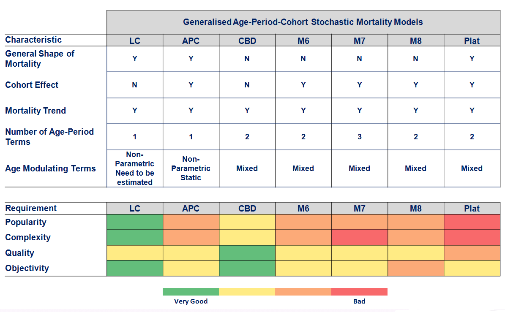</center>

## Random Component

The numbers of deaths $D_{xt}$ are independent

$D_{xt}$ follows a Poisson or a Binomial distribution

## Link Function

* Number of link functions possible
* Convenient to use canonical link
    * Log link for Poisson $\hat{\mu}_{xt} = log\mu_{xt}$
    * Logit link for Binomial $\hat{\mu}_{xt} = ln[\mu_{xt}/(1-\mu_{xt})]$


## Parameter Constraints

* Most stochastic mortality models not identifiable up to a transformation

* Therefore parameter constraints required to ensure unique parameter estimates

* Parameter constraints applied through constraint function

## Stochastic Models

Models sensitive to:

* Historical data

* Assumptions made

Good practice

* Understand and validate data

* Understand models and their assumptions

* Test several methods

* Compare and validate results

## <font color="white">.</font>
<center><font size="72"><b>R Workshop</b></font></center>

## R getting started

* Create a new folder and put the R scripts prepared for the workshop there
https://github.com/TARF/SMM/raw/master/Case_studies.zip

* Set working directory <b>Session > Set Working Directory > Choose Directory...</b> or press <b>Ctrl+Shift+H</b> and select the folder or use the console

```{r, eval=F}
setwd('<directory name>') # wrapped in '' 
## for Windows the path uses / instead \
```

* Install required packages

```{r, eval=FALSE}
install.packages(c("demography","StMoMo","rgl",
                   "googleVis","fanplot", "gdata"))
```

## Case Study {.small}

Slovak mortality data from Human Mortality Database

```{r, message=FALSE, warning=FALSE}
library(demography)
source("temp_functions.R")

skDemo<-hmd.mx("SVK", username=username, password=password)
# load("skDemo.RData")
years <- skDemo$year
ages<- skDemo$age
Dxt <- skDemo$rate[[3]] * skDemo$pop[[3]]
E0xt <- skDemo$pop[[3]] + 0.5 * Dxt
Ecxt <- skDemo$pop[[3]]
qxt <- Dxt/E0xt
```

## Inspect data {.small}
RStudio Environment double click the qxt object

```{R, message = FALSE, warning = FALSE, echo = FALSE}
library(DT)
formatRound(datatable(qxt, extensions = 'FixedColumns', 
    options = list(
    pageLength = 5,
    scrollX = TRUE,
    scrollCollapseq = TRUE)), 1:ncol(qxt), digits = 4) %>% formatStyle(1:ncol(qxt), `font-size` = "12px")
```

## Let's inspect mortality rates

```{r setup, results='asis', echo=FALSE, warning=FALSE}
library(knitr)
library(rgl)
knit_hooks$set(webgl = hook_webgl)
knitr::opts_chunk$set(cache=FALSE)
```
```{R, testgl, webgl=TRUE, echo=FALSE,  fig.height=5, warning=FALSE}
persp3d(ages[0:100], years, log(qxt)[0:100,], col="skyblue", shade=TRUE,xlab="Ages (0-100)",
        ylab="Years",zlab="Mortality rate (log)")
```

## Settings for Model Fitting

```{r, warning=FALSE, message=F, verbose=FALSE}
library(StMoMo)
forecastTime <- 120
ages.fit <- 25:90
weights <- genWeightMat(ages.fit, years, 3)

## Modelling
modelFit <- array(data = NA, c(7, 2))
rownames(modelFit) <- c("LC", "APC", "CBD", "M6", "M7", "M8", "PLAT")
colnames(modelFit) <- c("AIC", "BIC")
```

## Model Fit Criteria

* <b>AIC</b> tries to select the model that most adequately describes an unknown, high dimensional reality. Reality is never in the set of candidate models that are being considered. 

* <b>BIC</b> tries to find the TRUE model among the set of candidates.

* Best model minimizes AIC and BIC.

## Lee Carter Model {.smaller}


```{r, warning=FALSE, verbose=FALSE}
## LC model under a Binomial setting - M1
LC <- lc(link = "logit")
LCfit <- fit(LC, Dxt = Dxt, Ext= E0xt, ages = ages, years = years, 
             ages.fit = ages.fit, wxt = weights)
LCres <- residuals(LCfit)

## Collect the fit statistics
modelFit[1, 1] <- AIC(LCfit)
modelFit[1, 2] <- BIC(LCfit)
```

## Lee Carter Model Fitting Results {.smaller}


```{r}
plot(LCfit, nCol = 3)
```


## Forecast for Lee Carter {.smaller}


```{r}
## Forecast
LCfor <- forecast(LCfit, h = forecastTime)
LCqxt <- cbind(LCfor$fitted, LCfor$rates)
```
```{R, message = FALSE, warning = FALSE, echo = FALSE}
#head(LCqxt[,1:3], 3)
#tail(LCqxt[,178:180], 3)
library(DT)
formatRound(datatable(LCqxt, extensions = 'FixedColumns', 
                      options = list(
                        pageLength = 5,
                        scrollX = TRUE,
                        scrollCollapseq = TRUE)), 1:ncol(LCqxt), digits = 4) %>% formatStyle(1:ncol(LCqxt), `font-size` = "12px")
```
<div class="notes">
  In RStudio you can inspect the results by selecting the LCqxt table from <b>Data</b> in the Environment (right side).

</div>

## Projected Mortality
```{R, webgl=TRUE, echo=FALSE,  fig.height=5, warning=FALSE}
persp3d(ages[25:90], 1950:2129, log(LCqxt), col="skyblue", shade=TRUE,xlab="Ages (25-90)",
        ylab="Years",zlab="Mortality rate (log)")
```

## APC Model {.smaller}

```{r, message = FALSE, warning = FALSE, verbose=FALSE}
## Fitting APC Currie (2006) - M3
APC <- apc("logit")
APCfit <- fit(APC, Dxt = Dxt, Ext= E0xt, ages = ages, years = years, 
              ages.fit = ages.fit, wxt = weights, start.ax = LCfit$ax,
              start.bx = LCfit$bx, start.kt = LCfit$kx)

## Collecting fit results
modelFit[2, 1] <- AIC(APCfit)
modelFit[2, 2] <- BIC(APCfit)

## Forecasting
APCfor <- forecast(APCfit, h = forecastTime, gc.order = c(1, 1, 0))
APCqxt <- cbind(APCfor$fitted, APCfor$rates)
```
<div class="notes">
  * APC requires starting values - use fitted from LC model
* fit results will be investigated after all models are fitted
* comment on forecasting order ? 
</div>
  
## CBD Model {.smaller}

CBD model Cairns (2009) under a Binomial distribution of deaths Haberman and Renshaw (2011) - M5

```{r, message = FALSE, warning = FALSE, verbose=FALSE}
CBD <- cbd()
CBDfit <- fit(CBD, Dxt = Dxt, Ext= E0xt, ages = ages, years = years, 
              ages.fit = ages.fit, wxt = weights)

modelFit[3, 1] <- AIC(CBDfit)
modelFit[3, 2] <- BIC(CBDfit)

CBDfor <- forecast(CBDfit, h = forecastTime)
CBDqxt <- cbind(CBDfor$fitted, CBDfor$rates)
```

## M6 Model {.smaller}

```{r, message = FALSE, warning = FALSE, verbose=FALSE}
## M6
M6 <- m6()
M6fit <- fit(M6, Dxt = Dxt, Ext= E0xt, ages = ages, years = years, 
             ages.fit = ages.fit, wxt = weights)
modelFit[4, 1] <- AIC(M6fit)
modelFit[4, 2] <- BIC(M6fit)

M6for <- forecast(M6fit, h = forecastTime, gc.order = c(2, 0, 0))
M6qxt <- cbind(M6for$fitted, M6for$rates)
```

## M7 Model {.smaller}

```{r, message = FALSE, warning = FALSE, verbose=FALSE}
M7 <- m7(link = "logit")
M7fit <- fit(M7, Dxt = Dxt, Ext= E0xt, ages = ages, years = years, 
             ages.fit = ages.fit, wxt = weights)

modelFit[5, 1] <- AIC(M7fit)
modelFit[5, 2] <- BIC(M7fit)

M7for <- forecast(M7fit, h = forecastTime, gc.order = c(2, 0, 0))
M7qxt <- cbind(M7for$fitted, M7for$rates)
```

## M8 Model {.smaller}

```{r, message = FALSE, warning = FALSE, verbose=FALSE}
M8 <- m8(link = "logit", xc = 65)
M8fit <- fit(M8, Dxt = Dxt, Ext= E0xt, ages = ages, years = years, 
             ages.fit = ages.fit, wxt = weights)
modelFit[6, 1] <- AIC(M8fit)
modelFit[6, 2] <- BIC(M8fit)

M8for <- forecast(M8fit, h = forecastTime, gc.order = c(2, 0, 0))
M8qxt <- cbind(M8for$fitted, M8for$rates)
```

## PLAT Model {.smaller}

```{r, message = FALSE, warning = FALSE, verbose=FALSE}
f2 <- function(x, ages) mean(ages) - x
constPlat <- function(ax, bx, kt, b0x, gc, wxt, ages){
  nYears <- dim(wxt)[2]
  x <- ages
  t <- 1:nYears
  c <- (1 - tail(ages, 1)):(nYears - ages[1])
  xbar <- mean(x)
  phiReg <- lm(gc ~ 1 + c + I(c^2), na.action = na.omit)
  phi <- coef(phiReg)
  gc <- gc - phi[1] - phi[2] * c - phi[3] * c^2
  kt[2, ] <- kt[2, ] + 2 * phi[3] * t
  kt[1, ] <- kt[1, ] + phi[2] * t + phi[3] * (t^2 - 2 * xbar * t)
  ax <- ax + phi[1] - phi[2] * x + phi[3] * x^2
  ci <- rowMeans(kt, na.rm = TRUE)
  ax <- ax + ci[1] + ci[2] * (xbar - x)
  kt[1, ] <- kt[1, ] - ci[1]
  kt[2, ] <- kt[2, ] - ci[2]
  list(ax = ax, bx = bx, kt = kt, b0x = b0x, gc = gc)
}
```

## PLAT Model Fitting {.smaller}

```{r, message = FALSE, warning = FALSE, verbose=FALSE}
PLAT <- StMoMo(link = "logit", staticAgeFun = TRUE,
               periodAgeFun = c("1", f2), cohortAgeFun = "1",
               constFun = constPlat)
PLATfit <- fit(PLAT, Dxt = Dxt, Ext= E0xt, ages = ages, years = years, 
               ages.fit = ages.fit, wxt = weights)

modelFit[7, 1] <- AIC(PLATfit)
modelFit[7, 2] <- BIC(PLATfit)

PLATfor <- forecast(PLATfit, h = forecastTime, gc.order = c(2, 0, 0))
PLATqxt <- cbind(PLATfor$fitted, PLATfor$rates)
```

## Fitting Results {.smaller}


What model has the best fit?

```{r kable, echo=F}
kable(modelFit, digits=2)

modelsFitted <- list(LC = LCfit, APC = APCfit,
                     CBD = CBDfit,  M6 = M6fit, M7 = M7fit, M8 = M8fit, PLAT = PLATfit)
```
  
## Model Comparison {.smaller}
```{r, results="asis", warning=F, echo=F}
suppressPackageStartupMessages(library(googleVis))
op <- options(gvis.plot.tag='chart')
years_chart <- c(years, (years[length(years)]+1):(years[length(years)]+forecastTime))
df <- data.frame(models = years_chart, c((Dxt/E0xt)["65", ],rep (NA,120)),  LCqxt["65",])
colnames(df) <- c("Models", "Qxt", "LC")
Line <- gvisComboChart(df, options=list(width=800, height=500, fontName="Open Sans",  legend="right", 
        chartArea="{width:'70%',height:'70%'}", seriesType = "line", 
			  series='{0: {type:"scatter", pointShape: "triangle"}}', vAxis="{title:'Years projection'}",
			  vAxes="[{title:'Mortality rates at age 65'}]"))
plot(Line)
```

## Model Comparison {.smaller}
```{r, results="asis", warning=F, echo=F}
# ## Show BEL per model
df <- data.frame(models = years_chart, c((Dxt/E0xt)["65", ],rep (NA,120)),  LCqxt["65",], APCqxt["65",])
colnames(df) <- c("Models", "Qxt", "LC", "APC")
Line <- gvisComboChart(df, options=list(width=800, height=500, fontName="Open Sans",  legend="right", 
        chartArea="{width:'70%',height:'70%'}", seriesType = "line", 
			  series='{0: {type:"scatter", pointShape: "triangle"}}', vAxis="{title:'Years projection'}",
			  vAxes="[{title:'Mortality rates at age 65'}]"))
plot(Line)
```

## Model Comparison {.smaller}
```{r, results="asis", warning=F, echo=F}
# ## Show BEL per model
CBDqxt["65",1:3]<- CBDqxt["65",4]
df <- data.frame(models = years_chart, c((Dxt/E0xt)["65", ],rep (NA,120)),  LCqxt["65",], APCqxt["65",], CBDqxt["65",])
colnames(df) <- c("Models", "Qxt", "LC", "APC", "CBD")
Line <- gvisComboChart(df, options=list(width=800, height=500, fontName="Open Sans",  legend="right", 
        chartArea="{width:'70%',height:'70%'}", seriesType = "line", 
			  series='{0: {type:"scatter", pointShape: "triangle"}}', vAxis="{title:'Years projection'}",
			  vAxes="[{title:'Mortality rates at age 65'}]"))
plot(Line)
```

## Model Comparison {.smaller}
```{r, results="asis", warning=F, echo=F}
# ## Show BEL per model
df <- data.frame(models = years_chart, c((Dxt/E0xt)["65", ],rep (NA,120)),  LCqxt["65",], APCqxt["65",], CBDqxt["65",], M6qxt["65",])
colnames(df) <- c("Models", "Qxt", "LC", "APC", "CBD", "M6")
Line <- gvisComboChart(df, options=list(width=800, height=500, fontName="Open Sans",  legend="right", 
        chartArea="{width:'70%',height:'70%'}", seriesType = "line", 
			  series='{0: {type:"scatter", pointShape: "triangle"}}', vAxis="{title:'Years projection'}",
			  vAxes="[{title:'Mortality rates at age 65'}]"))
plot(Line)
```
## Model Comparison {.smaller}
```{r, results="asis", warning=F, echo=F}
# ## Show BEL per model
df <- data.frame(models = years_chart, c((Dxt/E0xt)["65", ],rep (NA,120)),  LCqxt["65",], APCqxt["65",], CBDqxt["65",], M6qxt["65",],
                M7qxt["65",])
colnames(df) <- c("Models", "Qxt", "LC", "APC", "CBD", "M6", "M7")
Line <- gvisComboChart(df, options=list(width=800, height=500, fontName="Open Sans",  legend="right", 
        chartArea="{width:'70%',height:'70%'}", seriesType = "line", 
			  series='{0: {type:"scatter", pointShape: "triangle"}}', vAxis="{title:'Years projection'}",
			  vAxes="[{title:'Mortality rates at age 65'}]"))
plot(Line)
```
## Model Comparison {.smaller}
```{r, results="asis", warning=F, echo=F}
# ## Show BEL per model
df <- data.frame(models = years_chart, c((Dxt/E0xt)["65", ],rep (NA,120)),  LCqxt["65",], APCqxt["65",], CBDqxt["65",], M6qxt["65",],
                M7qxt["65",], M8qxt["65",])
colnames(df) <- c("Models", "Qxt", "LC",  "APC", "CBD", "M6", "M7", "M8")
Line <- gvisComboChart(df, options=list(width=800, height=500, fontName="Open Sans",  legend="right", 
        chartArea="{width:'70%',height:'70%'}", seriesType = "line", 
			  series='{0: {type:"scatter", pointShape: "triangle"}}', vAxis="{title:'Years projection'}",
			  vAxes="[{title:'Mortality rates at age 65'}]"))
plot(Line)
```
## Model Comparison {.smaller}
```{r, results="asis", warning=F, echo=F}
# ## Show BEL per model
df <- data.frame(models = years_chart, c((Dxt/E0xt)["65", ],rep (NA,120)),  LCqxt["65",], APCqxt["65",], CBDqxt["65",], M6qxt["65",],
                M7qxt["65",], M8qxt["65",], PLATqxt["65",])
colnames(df) <- c("Models", "Qxt", "LC", "APC", "CBD", "M6", "M7", "M8", "PLAT")
Line <- gvisComboChart(df, options=list(width=800, height=500, fontName="Open Sans",  legend="right", 
        chartArea="{width:'70%',height:'70%'}", seriesType = "line", 
			  series='{0: {type:"scatter", pointShape: "triangle"}}', vAxis="{title:'Years projection'}",
			  vAxes="[{title:'Mortality rates at age 65'}]"))
plot(Line)
```
## Extrapolation {.smaller}

* Limited data, often poor quality at high ages
* Kannisto extrapolation

```{r}
extrapolate <- kannistoExtrapolation(qx=PLATqxt, ages=ages.fit, 
                                     years=years_chart, max_age=120, nObs=15)
PLATqxtExtr <- extrapolate$qxt
```

```{r, echo = F, warning=F}
LCextrapolate <- kannistoExtrapolation(LCqxt, ages.fit, years_chart)
LCqxtExtr <- LCextrapolate$qxt

APCextrapolate <- kannistoExtrapolation(APCqxt, ages.fit, years_chart)
APCqxtExtr <- APCextrapolate$qxt

CBDextrapolate <- kannistoExtrapolation(CBDqxt, ages.fit, years_chart)
CBDqxtExtr <- CBDextrapolate$qxt

M6extrapolate <- kannistoExtrapolation(M6qxt, ages.fit, years_chart)
M6qxtExtr <- M6extrapolate$qxt

M7extrapolate <- kannistoExtrapolation(M7qxt, ages.fit, years_chart)
M7qxtExtr <- M7extrapolate$qxt

M8extrapolate <- kannistoExtrapolation(M8qxt, ages.fit, years_chart)
M8qxtExtr <- M8extrapolate$qxt

models <- list(LCqxtExtr = LCqxtExtr, APCqxtExtr = APCqxtExtr, 
               CBDqxtExtr = CBDqxtExtr,  M6qxtExtr = M6qxtExtr, 
               M7qxtExtr = M7qxtExtr, M8qxtExtr = M8qxtExtr, PLATqxtExtr = PLATqxtExtr)
```


Curious about the function? 

Just type <b>kannistoExtrapolation</b> in the console.

## Portfolio Calculations {.smaller}

* Assumption: we have imaginary portofolio
* Premium read from input data
* Youngest entry age 25
* Retirement age 65
* Annuity is paid until age 120
* Annuity annual amount 1000 EUR
* Valuation year 2015

```{r}
## Read in portfolio data
portfolio <- read.csv('portfolio.csv')

## Assumptions
ages.fit <- 25:120
valyear <- 2015
pension <- 1000
```

## Experience Factors

  
Experience factors - observed portfolio mortality divided by population mortality.

```{r}
## Read in experience factors
experience.factors <- read.csv('experience-factors.csv')

# calculate ages of the insured
portfolio$age <- valyear - portfolio$YoB
experience.factors$total <- (experience.factors$Male + 
                               experience.factors$Female)/2
expF <- experience.factors$total[ages.fit]
```

## Best Estimate Liability {.smaller}

The expected or mean value of the present value of future cash flows for current
obligations, projected over the contract’s run-off period,
taking into account all up-to-date financial market and actuarial information.

* Calculate BEL for all models: LC, APC, CBD, M6, M7, M8 and PLAT.
* Use our function <b>DFcashflowfunction</b>

```{r, eval=F}
DFcashflow = function(qxt, ageStart, omegaAge, pensionAge, valyear, ir, type = 1)
```

* Function arguments: 
    - <b>qxt</b> - mortality rates
    - <b>ageStart</b> - age of the insured
    - <b>omegaAge</b> - omega age
    - <b>pensionAge</b> - retirement age
    - <b>valyear</b> - valuation year
    - <b>ir</b> - interest rate value (for simplifaction constant)
    - <b>type</b> - indicator for discounting premium or annuity

## BEL Calculations {.smaller}

  
```{r, warning = F}
BEL <- array(NA, c(7,1))
rownames(BEL) <- c("LC", "APC", "CBD", "M6", "M7", "M8", "PLAT")
colnames(BEL) <- "BEL"

for (m in 1:length(models)){
output <- list()
output2 <- list()
for (i in 1:nrow(portfolio)){
  output[[i]] <- DFcashflow(models[[m]]*expF, ageStart = portfolio$age[i], 
                            omegaAge = 120, pensionAge = 65, valyear = valyear, 
                            ir = 0.02, type = 1)*pension
  output2[[i]] <- DFcashflow(models[[m]]*expF, ageStart = portfolio$age[i], 
                             omegaAge = 120, pensionAge = 65, valyear = valyear, 
                             ir = 0.02, type = 2)*portfolio$Premium[i]
}
BEL[m, 1] <- round(do.call(sum, output)-do.call(sum, output2),2)
}
```

## BEL per Model

  
```{r, results="asis", warning=F, echo=F}
## Show BEL per model
suppressPackageStartupMessages(library(googleVis))
op <- options(gvis.plot.tag='chart')
df = data.frame(models = c("LC", "APC", "CBD", "M6", "M7", "M8", "PLAT"), BEL = BEL)
Column <- gvisColumnChart(df, options=list(
width=800, height=500, fontName="Open Sans", 
series="[{color:'#0A79BF'}]", vAxis="{title:'BEL (Euro)'}"))
plot(Column)
```

## Simulations for SCR

SCR is the amount of capital the insurance company needs to hold in order to survive a 1 in 200 event.

* Use stochastic simulations to calculate SCR

```{r}
set.seed(1234) ## Specify seed for Random Number Generation
nsim <- 200 ## Number of simulations
models2run <- length(modelsFitted) ## Number of models to loop for
ages.fit <- 25:90 ## Ages used in model fitting
```


## Simulations in R {.smaller}

  
```{r, cache=TRUE, warning=FALSE, echo = F}
modelSim <- list()
selectBEL <- list()
selectBEL2 <- array(NA, dim=c(7, 4))
for (m in 1:models2run){
  modelSim[[m]] <- simulate(modelsFitted[[m]], nsim = nsim, h = forecastTime)
  collectBEL <- array(NA, c(200,1))
  for (s in 1:nsim){
    prem_s <- 0
    ben_s <- 0
    qx <- cbind(modelSim[[m]]$fitted[, , s], modelSim[[m]]$rates[, , s])
    extrapolate <- kannistoExtrapolation(qx, ages.fit, years_chart)
    for (i in 1:nrow(portfolio)){
      ben_s <- ben_s+DFcashflow(extrapolate$qxt*expF, ageStart = portfolio$age[i], 
              omegaAge = 120, pensionAge = 65, valyear = valyear, 
              ir = 0.02, type = 1)*pension
      prem_s <- prem_s+DFcashflow(extrapolate$qxt*expF, ageStart = portfolio$age[i], 
                omegaAge = 120, pensionAge = 65, valyear = valyear, 
                ir = 0.02, type = 2)*portfolio$Premium[i]
    }
    collectBEL[s, 1] <- round(ben_s - prem_s, 2)
  }
  selectBEL[[m]] <- quantile(collectBEL, probs = 0.995, type = 1)
  selectBEL2[m,1] <- quantile(collectBEL, probs = 0.90, type = 1)
  selectBEL2[m,2] <- quantile(collectBEL, probs = 0.75, type = 1)
  selectBEL2[m,3] <- quantile(collectBEL, probs = 0.50, type = 1)
  selectBEL2[m,4] <- quantile(collectBEL, probs = 0.25, type = 1)
}
SCR <- round(as.numeric(selectBEL) - BEL, 2)
SCR_90 <- round(as.numeric(selectBEL2[,1]) - BEL, 2)
SCR_75 <- round(as.numeric(selectBEL2[,2]) - BEL, 2)
SCR_50 <- round(as.numeric(selectBEL2[,3]) - BEL, 2)
SCR_25 <- round(as.numeric(selectBEL2[,4]) - BEL, 2)
colnames(SCR) <- "SCR"
```

```{r, cache=TRUE, warning=FALSE, eval = F}
modelSim <- list()
selectBEL <- list()
for (m in 1:models2run){
  modelSim[[m]] <- simulate(modelsFitted[[m]], nsim = nsim, h = forecastTime)
  collectBEL <- array(NA, c(200,1))
  for (s in 1:nsim){
    prem_s <- 0
    ben_s <- 0
    qx <- cbind(modelSim[[m]]$fitted[, , s], modelSim[[m]]$rates[, , s])
    extrapolate <- kannistoExtrapolation(qx, ages.fit, years_chart)
    for (i in 1:nrow(portfolio)){
      ben_s <- ben_s+DFcashflow(extrapolate$qxt*expF, ageStart = portfolio$age[i], 
              omegaAge = 120, pensionAge = 65, valyear = valyear, 
              ir = 0.02, type = 1)*pension
      prem_s <- prem_s+DFcashflow(extrapolate$qxt*expF, ageStart = portfolio$age[i], 
                omegaAge = 120, pensionAge = 65, valyear = valyear, 
                ir = 0.02, type = 2)*portfolio$Premium[i]
    }
    collectBEL[s, 1] <- round(ben_s - prem_s, 2)
  }
  selectBEL[[m]] <- quantile(collectBEL, probs = 0.995, type = 1)
}
SCR <- round(as.numeric(selectBEL) - BEL, 2)
colnames(SCR) <- "SCR"
```

## Simulation Results

  
```{r, results="asis", warning=F, echo=F}
## Plot simulations for LC model
# qxt <- Dxt/E0xt
# plot(LCfit$years, qxt["65", ], xlim = c(1950, 2129), 
#      ylim = range(LCqxt["65",], modelSim[[1]]$rates["65", , 1:20]),
#      xlab = "Years", ylab = "Mortality rates", main = "Mortality rates at age 65",
#      pch = 20, log = "y", type = "l", bty="l")
# matlines(modelSim[[1]]$years, modelSim[[1]]$rates["65", , 1:20], type = "l", lty = 1, col = 1:20)
qxt <- Dxt/E0xt
df = data.frame(years_chart, c(qxt["65", ], rep(NA,120)), 
                sapply(1:20, function(x){c(rep(NA,60), modelSim[[1]]$rates["65", , x])}))
colnames(df) <- c("Years", "Observed Qxt", paste0("Simulation ", 1:20))
Column <- gvisLineChart(df,
                        options=list(
                            width=800, height=500, fontName="Open Sans",
                            legend='none', vAxes="[{title:'Mortality rates at age 65'}]"))
#series='{0: {type:"scatter", pointShape: "triangle"}}'
plot(Column)
```

## Simulation Uncertainity
Percentails (%): 0.5, 2.5, 10, 25, 75, 90, 97.5, 99.5

```{r, echo = F, message = FALSE, out.height="500cm", out.width="780cm", fig.retina = 2, dev='CairoSVG', warning=FALSE}
library(fanplot)
probs <- c(0.5, 2.5, 10, 25, 75, 90, 97.5, 99.5)
plot(LCfit$years, qxt["65", ], xlim = c(1950, 2129), ylim = c(0.0025, 0.04),
     xlab = "Years", ylab = "Mortality rates at age 65", main = "Uncertainity associated with a model forecast",
     pch = 20, log = "y", bty="n")
fan(t(modelSim[[1]]$rates["65", , ]), start = 2010, probs = probs, n.fan = 4,
    fan.col = colorRampPalette(c("yellow", "darkgreen")), bty="n", ln=NULL)
```

## Show SCR for Models

```{r, results="asis", warning=F, echo=F}
## Show BEL per model
df = data.frame(models = c("LC", "APC", "CBD", "M6", "M7", "M8","PLAT"), BEL = BEL, SCR = SCR)
Column <- gvisColumnChart(df,
                          options=list(
                            width=800, height=500, fontName="Open Sans",
                            series="[{color:'#0A79BF'}, {color: '#B2246B'}]", vAxis="{title:'BEL vs.SCR (Euro)'}"))
plot(Column)
```

## Different Capital Requirements

```{r, results="asis", warning=F, echo=F}
df = data.frame(models = c("LC", "APC", "CBD", "M6", "M7", "M8","PLAT"), 
                SCR_50=SCR_50, SCR_75=SCR_75-SCR_50, SCR_90=SCR_90-SCR_75, SCR = SCR-SCR_90)
colnames(df) <- c("Models", "CR 50%", "CR 50% vs. 75%", "CR 75% vs. 90%", "CR 90% vs. 99.5%")
SteppedArea <- gvisSteppedAreaChart(df, options=list(width=800, height=500, fontName="Open Sans", 
                                                     vAxis="{title:'CR Quantiles (Euro)'}", isStacked=TRUE))
plot(SteppedArea)
```


## <font color="white">.</font>
<center><font size="72"><b>Case Studies</b></font></center>

  
<center>Now it's your turn.</center>

## Case 1


It's time to play with portfolio data. 
Task is to make everybody in our <b>portfolio 5 years older</b>.

Can we form any expections regarding the <b>BEL and SCR</b> values?

Open Case_study_1.R instructions and code to adjust is commented out.


## Case 2

  
Now <b>shorten the time trend</b>. Instead of using hitory data from 1950 we will just focus on <b>1989 to 2009</b>.

Can we form any expections regarding the <b>BEL and SCR</b> values?

Open Case_study_2.R instructions and code to adjust is commented out.


## Case 3

  
For all the analysis done so was <b>raw data</b> was used.
Let's check what happens if we used <b>smoothing</b>.

Can we form any expections regarding the <b>BEL and SCR</b> values?

Open  Case_study_3.R instructions and code to adjust is commented out.

## Case 4

To the list of already fitted models add amortality table that assumes <b>constant mortality rates after 2009</b>.
Projection period remains 120.
Extrapolation is used for ages 91-120.

Can we form any expections regarding the <b>BEL</b> value?

Open Case_study_4.R instructions and code to adjust is commented out.

## References {.smaller}

["StMoMO: An R Package for Stochastic Mortality Modelling"](https://cran.r-project.org/web/packages/StMoMo/vignettes/StMoMoVignette.pdf) A.M. Villegas et al.

["Stochastic Modelling of Mortality Risks"](http://dare.uva.nl/cgi/arno/show.cgi?fid=22881) Frankie Gregorkiewicz

["Solvency II Glossary"](http://ec.europa.eu/internal_market/insurance/docs/solvency/impactassess/annex-c08d_en.pdf) CEA and the Groupe Consultatif

["R: The most powerful and most widely used statistical software"](https://www.youtube.com/watch?v=TR2bHSJ_eck&feature=youtu.be) Revolution Analytics

## Contact

<b>Franciszek Gregorkiewicz</b>

    franciszek.gregorkiewicz@aaa-riskfinance.nl
    +48 605 682 112
	
<b>Olga Mierzwa</b>

    olga.mierzwa@aaa-riskfinance.nl
    +48 798 878 358
	
Presentation and source code available on GitHub:
https://github.com/TARF/SMM/

## Who We Are? {.smaller}

<b>An independent and innovative consultancy firm specialized in the field of actuarial science and risk management</b>

* Founded in 2006
* 80 FTE in 2015
* Headquarters in Amsterdam
* Local, dedicated office in <b>Warsaw</b>
* Highly qualified and trained actuaries and risk professionals

<b>Comprehensive, hands-on services for insurance companies</b>

* <b>Actuarial modeling</b>
* Solvency II and regulation
* Risk management function
* Actuarial function
* Governance
* Strategy and profitability
* Investment consulting and ALM

